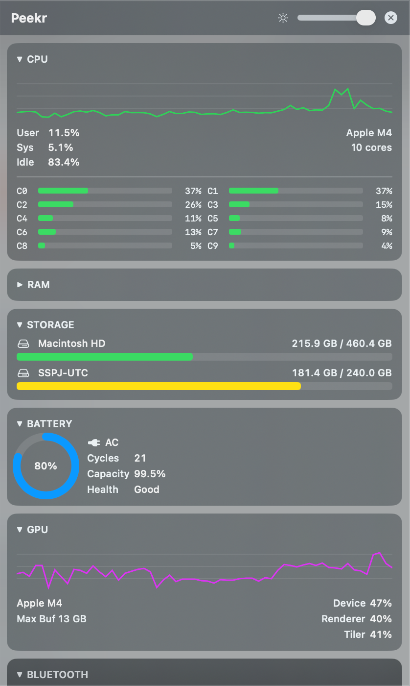

# Peekr

A lightweight, always-on-top floating widget for monitoring your Mac's system resources in real time. Each widget is collapsible and reorderable — keep only what you need, exactly where you want it.

[日本語](README.ja.md)



## Features

- **CPU** — Usage, per-core load
- **Memory** — Used, compressed, swap
- **Storage** — Free space, usage ratio
- **Battery** — Charge, charging state, cycle count
- **GPU** — Utilization
- **Network** — Upload/download speeds
- **Wi-Fi** — SSID, signal strength, channel
- **Audio** — Mic waveform, speaker waveform, device names
- **Bluetooth** — Paired devices, connect/disconnect
- **USB** — Connected devices, VID:PID
- **Display** — Resolution, refresh rate, brightness
- **Thermal** — Thermal state (4 levels)

### Additional
- Always-on-top floating window
- Opacity slider (20–100%)
- Collapsible widgets with inline summary (state persists across restarts)
- Drag & drop widget reordering (persists)
- Menu bar icon to show/hide window

## Requirements

- macOS 15.0 or later
- Apple Silicon (M1 or later)

## Install

### Homebrew (recommended)

```bash
brew tap kazuhitogo/tap
brew install --cask peekr
```

### Manual

1. Download `Peekr.zip` from [Releases](https://github.com/kazuhitogo/mac-peekr/releases)
2. Unzip and move `Peekr.app` to `/Applications`
3. **First launch**: right-click → Open → Open (Gatekeeper bypass)

Or via Terminal:

```bash
xattr -cr /Applications/Peekr.app
```

### Permissions

Requested on first launch:

- **Microphone** — mic waveform display
- **Screen Recording** — speaker waveform via ScreenCaptureKit

## Build from Source

```bash
git clone https://github.com/kazuhitogo/mac-peekr.git
cd mac-peekr
xcodebuild -project MacSystemMonitor.xcodeproj \
           -scheme MacSystemMonitor \
           -configuration Release \
           -derivedDataPath build build
```

## License

[Apache License 2.0](LICENSE)
